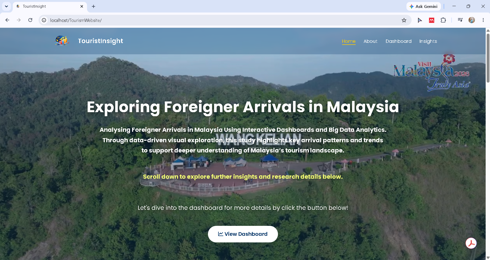
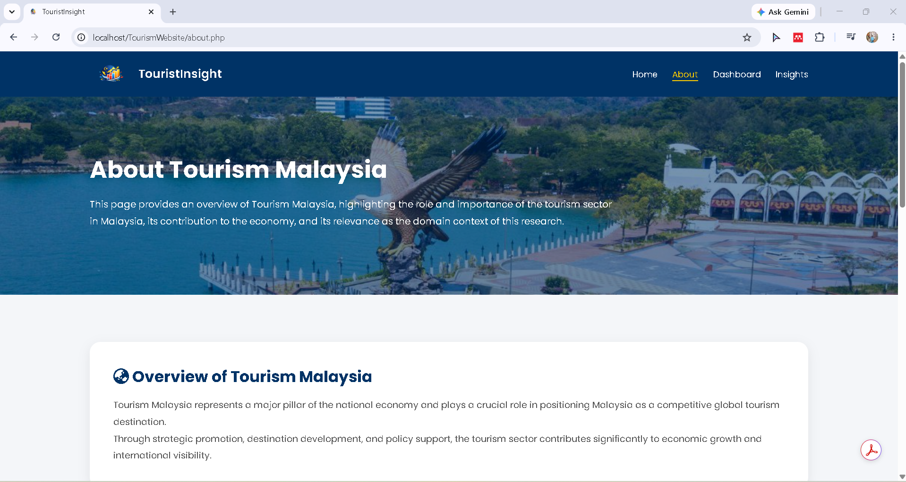
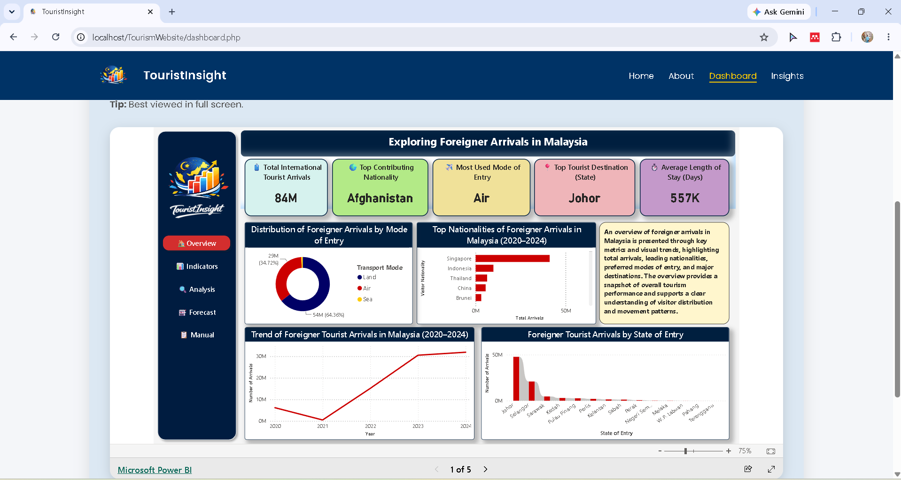
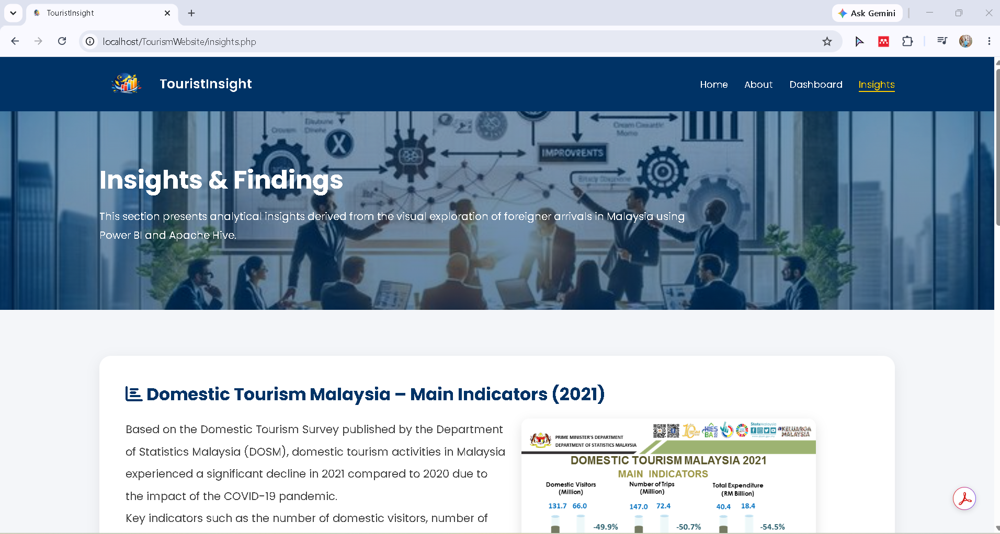

# 🌍 TouristInsight: Exploring Foreigner Arrivals in Malaysia

> **Final Year Project (FYP)**
> Bachelor of Information Technology (Hons.) – Data Analytics & Big Data
> Universiti Teknologi MARA (UiTM)

---

# 📌 Project Overview

**TouristInsight** is a web-based tourism analytics platform developed as my Final Year Project (FYP). The project integrates **Apache Hive**, **Microsoft Power BI**, **PHP**, and **MySQL** to transform tourism datasets into meaningful dashboards and interactive visualizations.

The system enables users to explore foreign tourist arrival trends in Malaysia through an interactive website while demonstrating the integration of Big Data technologies with Business Intelligence tools.

---

# 🌐 Live Demo

## ⚠️ Website Status

The original website was previously deployed on a hosting service for demonstration purposes. However, the hosting subscription has expired, so the website is currently unavailable online.

Although the website is no longer accessible, the interactive Power BI dashboard remains publicly available.

### 📊 Power BI Dashboard

https://app.powerbi.com/links/fXMBcdS9NH?ctid=cdcbb0e2-9fea-4f54-8670-672707797ada&pbi_source=linkShare

---

# 🎯 Project Objectives

* Develop an interactive tourism analytics website.
* Process tourism datasets using Apache Hive.
* Visualize tourism data using Microsoft Power BI.
* Present meaningful tourism insights.
* Support data-driven decision making through interactive dashboards.

---

# ✨ System Features

## 🏠 Home

* Project introduction
* Tourism overview
* Project highlights
* Research objectives
* Navigation to analytics pages

---

## ℹ️ About

Provides information regarding:

* Project background
* Problem statement
* Research objectives
* Technologies used
* System architecture

---

## 📊 Interactive Dashboard

Embedded Microsoft Power BI dashboard featuring:

* KPI Cards
* Monthly Tourist Arrivals
* Foreigner Arrivals Trend
* Top Visiting Countries
* State of Entry Analysis
* Transportation Mode Analysis
* Visitor Categories
* Forecast Analysis
* Interactive Filters & Slicers

---

## 📈 Tourism Insights

Displays analytical findings including:

* Tourism trends
* Country comparison
* Arrival patterns
* Dashboard interpretation
* Data-driven insights
* Research findings

---

# 🚀 Technologies Used

| Category              | Technology              |
| --------------------- | ----------------------- |
| Frontend              | HTML5, CSS3, JavaScript |
| Backend               | PHP                     |
| Database              | MySQL                   |
| Big Data Processing   | Apache Hive             |
| Business Intelligence | Microsoft Power BI      |
| Development Tools     | Visual Studio Code      |
| Local Server          | XAMPP                   |

---

# 📂 Project Structure

```
TourismWebsite/
│
├── assets/
├── images/
│   ├── home.png
│   ├── about.png
│   ├── dashboard1.png
│   ├── dashboard.png
│   └── insights.png
│
├── includes/
│
├── index.php
├── about.php
├── dashboard.php
├── insights.php
│
└── README.md
```

---

# 📷 Website Preview

## 🏠 Home Page



---

## ℹ️ About Page



---

## 📊 Interactive Dashboard



---

## 📈 Tourism Insights



---

# 📊 Dashboard Analytics

The Microsoft Power BI dashboard provides:

* Total Tourist Arrivals
* Monthly Tourist Arrivals
* Foreigner Arrivals Trend
* Top Visiting Countries
* Transportation Mode Analysis
* State of Entry Analysis
* Visitor Categories
* Average Length of Stay
* Forecast Analysis
* Interactive Filtering

---

# 💡 Dataset Information

## Source

* Department of Statistics Malaysia (DOSM)
* Tourism Malaysia

## Coverage

**2020 – 2024**

## Dataset Attributes

* Year
* Month
* Nationality
* State of Entry
* Point of Entry
* Transportation Mode
* Visitor Category
* Average Stay Duration
* Number of Tourist Arrivals

---

# ⚙️ System Workflow

```
Tourism Dataset
        │
        ▼
Apache Hive
(Data Cleaning & Processing)
        │
        ▼
Processed Dataset
        │
        ▼
Microsoft Power BI
(Interactive Dashboard)
        │
        ▼
PHP Website
        │
        ▼
End Users
```

---

# 📈 Key Skills Demonstrated

* Data Analytics
* Business Intelligence
* Dashboard Development
* Data Visualization
* Apache Hive
* SQL
* PHP Development
* Microsoft Power BI
* Big Data Processing
* ETL Process
* Website Development
* Interactive Dashboard Design

---

# 🖥️ Installation Guide

## Requirements

* XAMPP
* Apache Hive
* Microsoft Power BI Desktop
* Web Browser

---

## Installation Steps

### 1. Clone Repository

```bash
git clone https://github.com/yahyarofiee/Final-Year-Project-FYP-_Degree.git
```

### 2. Copy the Project

Move the project folder into:

```
xampp/htdocs/
```

### 3. Start XAMPP

Start the following services:

* Apache
* MySQL

### 4. Open in Browser

```
http://localhost/TourismWebsite/
```

---

# 🎓 Learning Outcomes

Through this project, I gained practical experience in:

* Big Data Analytics
* Apache Hive
* Microsoft Power BI
* Dashboard Development
* Business Intelligence
* Data Visualization
* PHP Web Development
* SQL Query Development
* ETL Process
* System Integration

---

# 🔮 Future Improvements

Potential enhancements include:

* User authentication
* Admin dashboard
* Real-time database integration
* API integration
* Machine Learning prediction
* Responsive mobile interface
* Cloud deployment
* Advanced analytics dashboard

---

# 👨‍💻 Author

**Yahya Naim bin Md Rofiee**

Bachelor of Information Technology (Hons.)

**Specialization:** Data Analytics & Big Data

Universiti Teknologi MARA (UiTM)

---

# 📄 Disclaimer

This project was developed as a Final Year Project (FYP) for academic purposes at Universiti Teknologi MARA (UiTM).

The tourism data used in this project was obtained from publicly available sources, including the Department of Statistics Malaysia (DOSM) and Tourism Malaysia. The project is intended solely for educational and demonstration purposes.

---

# ⭐ Repository Highlights

* Interactive Tourism Analytics Website
* Microsoft Power BI Dashboard Integration
* Apache Hive Big Data Processing
* PHP-Based Web Application
* Business Intelligence Dashboard
* Data Analytics & Visualization
* Final Year Project (FYP)
